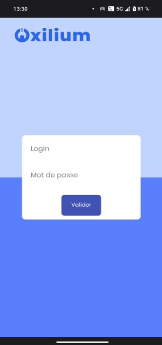

 

<h3 align="center">Oxilium Android</h3>

Version lite de l'application web <a href="github.com/EwenDev/Oxilium">Oxilium</a> adaptée pour une application Android
 
<a href="#introduction"><strong>Explorer la documentation »</strong></a>
 

[![java][java]][java-url]
[![android][android]][android-url]
[![XML][XML]][xml-url]
[![GITHUB][github]][github-url]

  
Sommaire

  <ol>
    <li>
      <a href="#introduction">Introduction</a>
    </li>
    <li>
      <a href="#bien-commencer">Bien commencer</a>
      <ul>
        <li><a href="#pré-requis">Pré-requis</a></li>
        <li><a href="#utilisation">Utilisation</a></li>
      </ul>
    </li>
    <li><a href="#contributeurs">Contributeurs</a></li>
  </ol>

## Introduction

Oxilium Android est une version très simplifiée de l'application [Oxilium](github.com/EwenDev/Oxilium) réalisée en 5 heures, adaptée pour une utilisation sur Android. On pourrait la considérer comme une version de demo pour le client, version étant en grande partie statique.

Cette version lite permet :
- De se connecter à un compte utilisateur
- De consulter son tableau de bord avec l'avancée de ses tickets (tickets statiques)
- De consulter les détails d'un ticket 
- De créer un ticket (statique)
- De se connecter en tant que technicien pour consulter les tickets en attente et modifier leur statut (statique)

(<a href="#readme-top">Retourner au début</a>)

## Bien commencer

### Pré-requis

Pour commencer à travailler sur le projet, il vous faudra les outils suivants :
* Un editeur de code qui supporte Android (Android Studio)
* Un JDK pour compiler le code
* Un émulateur Android pour tester l'application
* Git pour cloner le projet

### Utilisation

Il s’agit de la page d’accueil qui est aussi la page de connexion. Voici les informations afin de vous connecter en tant qu’utilisateur :

- **Login :** oxilium.user
- **Mot de passe** : oxilium.passwordu

Et voici les informations pour vous connecter en tant que technicien :

- **Login** : oxilium.tech
- **Mot de passe** : oxilium.passwordt

**Toute autre tentative de connexion échouera.**

Une fois connecté en tant qu’**utilisateur**, vous aurez accès à des tickets statiques sauf le premier qui possède les informations rentrées dans la page de création de tickets. Vous pourrez aussi créer un nouveau ticket (et donc modifier les informations du premier ticket) en cliquant sur le bouton **Créer un ticket**.

Une fois connecté en tant que **technicien**, vous aurez accès à une page avec des tickets et la possibilité de changer le statut de l’avancée du ticket. **Les statuts ne changeront pas les tickets du côté utilisateur.** Les différents statuts :
- En cours
- En attente
- Terminé

Vous connaissez maintenant tout sur le fonctionnement de l’application Oxilium !

## Contributeurs

<table>
  <tbody>
    <tr>
      <td align="center" valign="top" width="14.28%"><a href="https://github.com/NoXeDev"> <b>NoXeDev</b></a></td>
      <td align="center" valign="top" width="14.28%"><a href="https://github.com/EwenDev"> <b>EwenDev</b></a></td>
      <td align="center" valign="top" width="14.28%"><a href="https://github.com/ComeRegnier"> <b>ComeRegnier</b></a></td>
      <td align="center" valign="top" width="14.28%"><a href="https://github.com/MaxOuvrard"> <b>MaxOuvrard</b></a></td>
      <td align="center" valign="top" width="14.28%"><a href="https://github.com/ldv500"> <b>ldv500</b></a></td>
    </tr>
  </tbody>
</table>

[java]: https://img.shields.io/badge/JAVA-02303A?style=for-the-badge&logo=gradle&logoColor=white
[java-url]: https://www.java.com/
[android]: https://img.shields.io/badge/ANDROID-34A853?style=for-the-badge&logo=android&logoColor=white
[android-url]: https://developer.android.com/
[xml]: https://img.shields.io/badge/XML-005FAD?style=for-the-badge&logo=xml&logoColor=white
[xml-url]: https://www.w3schools.com/xml/
[github]: https://img.shields.io/badge/github-181717?style=for-the-badge&logo=github&logoColor=white
[github-url]: https://github.com/